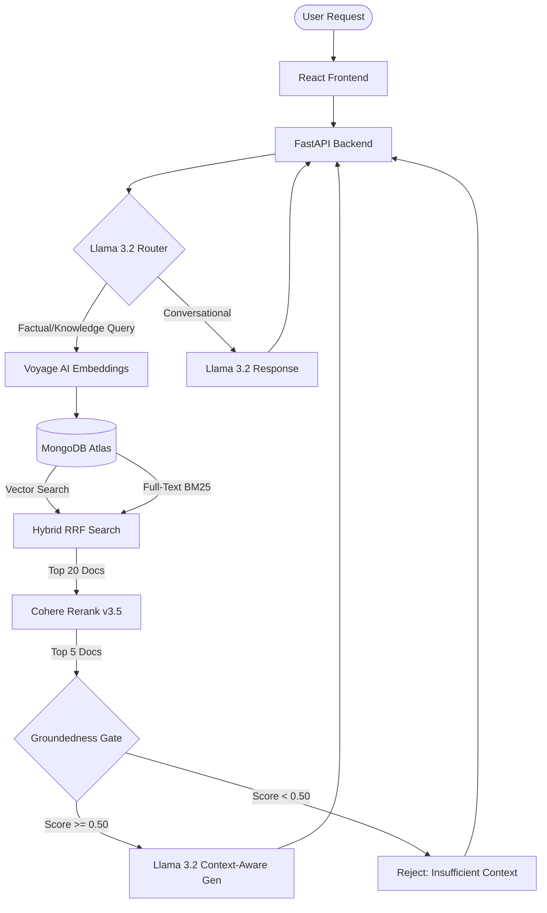

<div align="center">
  <h1>Argus: Enterprise-Grade RAG Agent</h1>
  <p>A highly secure, hallucination-resistant Retrieval-Augmented Generation agent powered by Hybrid Search, Semantic Reranking, and a strict Pre-Generation Groundedness Gate.</p>

  
  
  
  
  
  
  
</div>

<br/>

## System Architecture

Argus is not a standard LLM wrapper. It is an enterprise-grade agent built to guarantee factual accuracy. If the agent does not possess the correct contextual knowledge in its database, it is mathematically blocked from answering.



## Core Features

### 1. Hybrid Search (Vector + Full Text)
Standard vector search struggles with exact keyword matches (like acronyms or IDs). Argus implements a Hybrid Search pipeline by running a Vector Search (`$vectorSearch`) and a Full-Text Keyword Search (`$search`) in parallel across MongoDB Atlas. The result sets are mathematically merged using Reciprocal Rank Fusion (RRF).

### 2. Semantic Cross-Encoder Reranking
Hybrid search retrieves the top 20 candidate documents, but they are often noisy. Argus passes these candidates through Cohere's `rerank-v3.5` cross-encoder model, which analyzes the deep semantic relationship between the user's exact query and the document chunks. This step alone provides an 8% absolute boost in Context Precision.

### 3. The Groundedness Gate
To guarantee zero hallucinations on out-of-domain queries, Argus implements a pre-generation Groundedness Gate. If the absolute highest relevance score returned by the Cohere reranker is below our empirically tuned threshold (0.50), the system preemptively short-circuits. It bypasses the generation LLM entirely and safely responds: "I don't have enough information in the provided documents to answer that."

### 4. Live RAGAS Evaluation
The system features a live evaluation endpoint that utilizes the RAGAS framework (Faithfulness, Answer Relevancy, Context Precision). Using Groq's high-speed API (Llama-3.1-120B) as an LLM-as-a-Judge and local BAAI embeddings, the UI dynamically grades the agent's performance and reranker impact in real-time.

## Challenges and Solutions

### The "LLM Bypass" Hallucination Loophole
**Problem:** During adversarial testing, out-of-domain queries (e.g., "What is the recipe for cookies?") successfully bypassed the Groundedness Gate. The local Llama 3.2 router was "too smart" - recognizing the query was unrelated to the database, it intelligently decided to skip the vector search tool entirely. It routed the query to its general conversational tool and used its pre-trained weights to answer the question, causing a severe hallucination risk for an enterprise context.
**Solution:** Hardened the Agent Router prompt. Forced all factual or knowledge-based queries to strictly route through the vector search tool, regardless of their perceived domain. This ensured that out-of-domain questions hit the vector database, returned mathematically low relevance scores, and were successfully intercepted and blocked by the Groundedness Gate threshold without false positives.

### API Rate Limiting and RAGAS Evaluation Bottlenecks
**Problem:** Running quantitative evaluations using the RAGAS framework triggered severe `429 Too Many Requests` errors when using the Gemini free-tier for the LLM-as-a-Judge, and Voyage AI for embeddings. Furthermore, Context Precision calculations failed entirely because the local 3B parameter Llama 3.2 model could not reliably output strict JSON required by the RAGAS parser.
**Solution:** Architected a hybrid evaluation pipeline. Switched the Judge LLM to Groq's high-speed API (Llama-3.1-120B) for reliable, strict JSON parsing without rate limits, and migrated the evaluation embeddings to a local, offline `BAAI/bge-base-en-v1.5` model via HuggingFace to completely eliminate embedding API constraints.

## Setup Instructions

1. Install Python requirements:
   ```bash
   pip install -r requirements.txt
   ```
2. Create a `.env` file with your API keys:
   ```
   MONGO_URI=your_mongodb_uri
   VOYAGE_API_KEY=your_voyage_key
   COHERE_API_KEY=your_cohere_key
   GROQ_API_KEY=your_groq_key
   ```
3. Start the FastAPI backend:
   ```bash
   uvicorn app:app --reload --port 8000
   ```
4. Start the React frontend:
   ```bash
   cd argus-ui
   npm run dev
   ```
