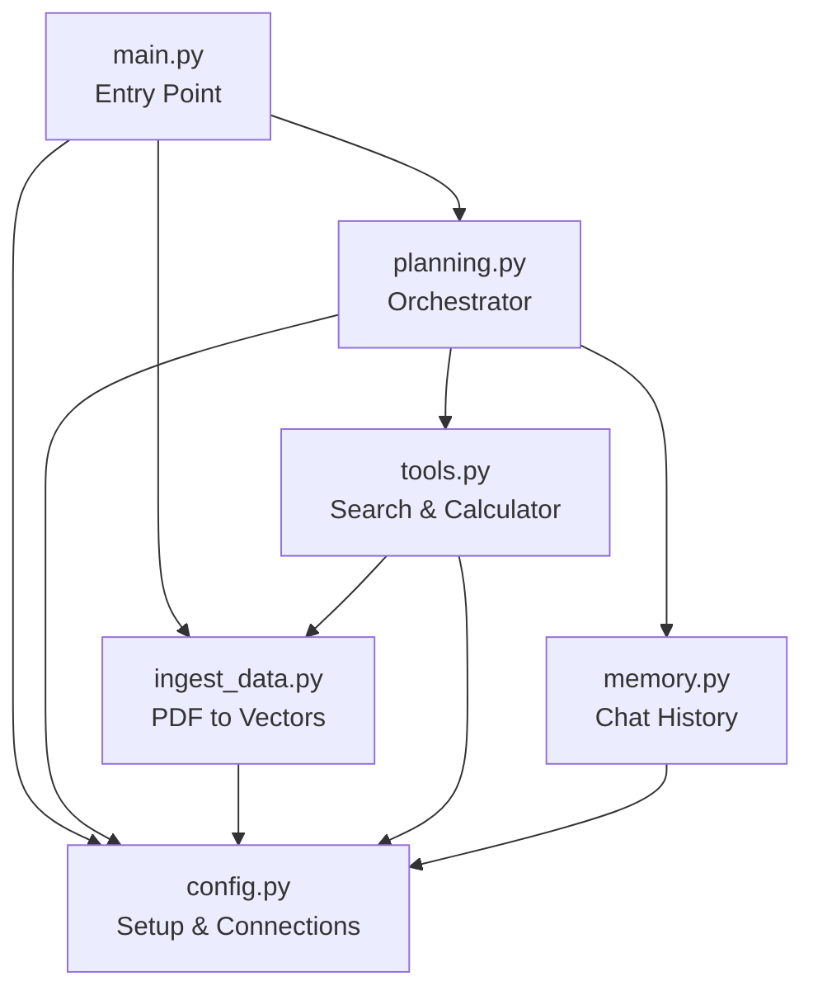
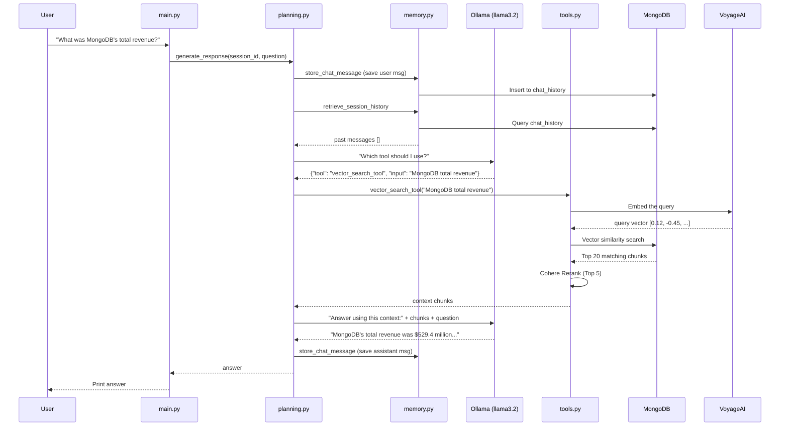

# MiniAIagent - RAG Evaluation and Agent Orchestration

## Overview

This project implements a Retrieval-Augmented Generation (RAG) chatbot designed to answer questions about specific documents (e.g., MongoDB's earnings report) using a hybrid approach of conversational memory, vector search, and reranking. Instead of relying solely on an LLM's pre-trained knowledge, the agent fetches grounded facts from a vector database before synthesizing its response.

The project also features a tool-calling orchestrator, safe calculator capabilities, and an automated evaluation pipeline using the RAGAS framework.

---

## Architecture and File Structure

### 1. `config.py` - The Setup File
**Role:** Initializes connections to external services and stores global configuration.
- **MongoDB:** Connects to the cluster and provisions the `ai_agent_db` database with `embeddings` and `chat_history` collections.
- **Voyage AI:** Initializes the embedding model (`voyage-4-large`).
- **Ollama:** Connects to a local server running `llama3.2` as the core reasoning engine.
- **Cohere:** Initializes the reranking client (`rerank-v3.5`).

### 2. `ingest_data.py` - The Data Loader
**Role:** Downloads the source PDF, splits it into semantic chunks, generates embeddings, and indexes them in MongoDB.
- Uses `PyPDFLoader` for ingestion and `RecursiveCharacterTextSplitter` for chunking (~400 characters).
- Sends chunks to Voyage AI to retrieve 1024-dimension vectors.
- Creates a vector search index in MongoDB Atlas.
- Features resilient retry logic and exponential backoff for handling API rate limits.

### 3. `memory.py` - Conversation Memory
**Role:** Persists chat history across multi-turn interactions.
- `store_chat_message(session_id, role, content)`: Saves individual messages to MongoDB.
- `retrieve_session_history(session_id)`: Fetches chronological conversational context for the orchestrator.

### 4. `tools.py` - Agent Capabilities
**Role:** Defines the functions the LLM orchestrator can invoke.
- **`vector_search_tool(user_input)`**: The retrieval step. Embeds the query, searches MongoDB for the top 20 candidates, and applies a Cohere reranker to return the absolute top 5 chunks.
- **`calculator_tool(user_input)`**: A safe mathematical evaluator utilizing Python's AST (Abstract Syntax Tree) to parse and execute basic arithmetic without relying on unsafe `eval()` calls.

### 5. `planning.py` - The Orchestrator
**Role:** The core decision-making loop that governs tool execution and response generation.
- **`tool_selector`**: Analyzes the user's intent and current conversation state to determine whether to call `vector_search_tool`, `calculator_tool`, or bypass tools entirely.
- **`generate_response`**: Manages the end-to-end pipeline (save to memory -> select tool -> execute tool -> prompt LLM with context -> return answer).

### 6. `evaluate_ragas.py` - Automated Evaluation
**Role:** A standalone script that leverages the RAGAS framework to evaluate pipeline performance.
- Evaluates metrics including **Faithfulness**, **Answer Relevancy**, and **Context Precision**.
- Swappable judge models (configured to use Gemini or local Ollama).

---

## End-to-End Workflow

The following sequence diagram illustrates the lifecycle of a query requiring context retrieval:

## Evaluation (RAGAS)

To ensure the agent produces grounded and accurate responses, the pipeline is evaluated using the **RAGAS** (Retrieval Augmented Generation Assessment) framework. 

The evaluation script (`evaluate_ragas.py`) measures three critical dimensions of the RAG system:
- **Faithfulness (0.90):** Measures hallucination. A score of 0.90 indicates that 90% of the claims made by the LLM are directly backed by the retrieved MongoDB chunks.
- **Answer Relevancy (0.75):** Measures how well the generated answer addresses the user's initial query, using Cohere embeddings to penalize off-topic responses.
- **Context Precision:** Measures the signal-to-noise ratio of the retrieved chunks. By implementing the **Cohere Reranker**, we ensure the top 5 chunks injected into the prompt are highly relevant, drastically reducing LLM confusion.

## Technology Stack

| Component | Technology | Purpose |
|---|---|---|
| **LLM (Agent)** | Ollama / llama3.2 | Reasoning engine and response generation |
| **LLM (Judge)** | Gemini / Ollama | RAGAS evaluation |
| **Embeddings** | Voyage AI (`voyage-4-large`) | Text vectorization |
| **Vector DB** | MongoDB Atlas | Similarity search and storage |
| **Reranking** | Cohere (`rerank-v3.5`) | Precision context ranking |
| **Frameworks** | LangChain & RAGAS | Text splitting, prompt formatting, evaluation |
